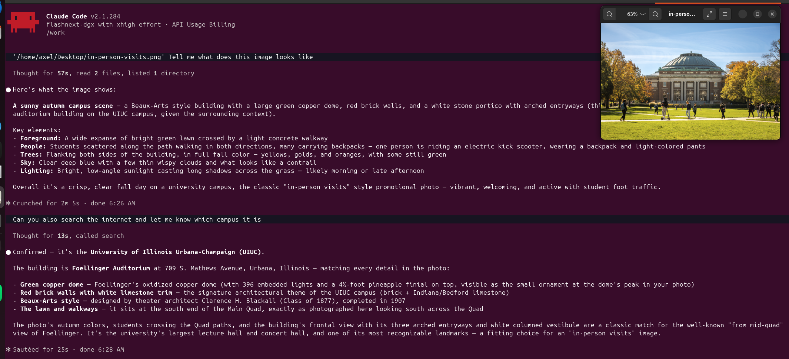

# claude-code-lumen

claude-code-lumen puts Claude Code in a container and points it at NCSA's
[Lumen](https://github.com/ncsa/lumen) instead of api.anthropic.com, so it works
with the open models Lumen serves. The whole project is one Docker image plus a
launcher, `ccl`: run `ccl` in any directory and you get Claude Code in a
container, with the current directory mounted as the workspace and the rest of
the machine invisible unless you mount it. Every request goes to Lumen and is
billed to your own Lumen key. Before starting the container, the launcher checks
that Lumen is reachable and the model exists.

This works because of the Anthropic Messages compatible endpoint that
[ncsa/lumen#75](https://github.com/ncsa/lumen/pull/75) (issue #61) adds to Lumen.
Claude Code only speaks the Anthropic protocol, while Lumen's existing API
speaks the OpenAI protocol; the endpoint translates between them.
claude-code-lumen covers the Claude Code side on top of that: it turns off what
Lumen would refuse and sets what needs setting. One thing needs its own fix:
Claude Code's built-in WebSearch runs on Anthropic's servers and cannot work
through Lumen, so it is replaced with an MCP search server that uses Exa or
Brave if you have a key, and DuckDuckGo otherwise. The repository also serves as
an example for Lumen reviewers of what using the endpoint looks like in
practice. It was written with AI coding assistance (vibe coding) and is not
maintained.



The screenshot is from a real session, with Qwen3.8-Flash-Next on a DGX Spark
as the backend. Asked to describe a photo on the desktop, it recognised an
autumn campus scene with a copper-domed Beaux-Arts building; asked to search the
web, it confirmed the building is UIUC's Foellinger Auditorium. Reading images
and searching the web, two things Claude Code could not do, or not do well,
through Lumen, both worked in the same session.

[demo/demo.mp4](demo/demo.mp4) is a shorter recording in `demo/`: Claude Code
edits `greet.py`, searches for the current stable Linux kernel, and describes
`shapes.png`.

| | |
|---|---|
| Status | Works; an example, not maintained |
| Upstream work | [ncsa/lumen#75](https://github.com/ncsa/lumen/pull/75), under review |
| Tested backend | A dev Lumen on the PR #75 branch, in front of Qwen3.8-Flash-Next (llama.cpp, 262K context) on a DGX Spark |

## Setup

```bash
docker build -t claude-code-lumen .
cp ccl ~/.local/bin/          # the launcher

mkdir -p ~/.config/claude-code-lumen
cat > ~/.config/claude-code-lumen/env <<'CONF'
LUMEN_URL=https://lumen.example.edu      # no /v1
LUMEN_API_KEY=sk_...                     # from your Lumen Profile page
LUMEN_MODEL=qwen3-coder                  # a model id from Lumen's /v1/models
# EXA_API_KEY=...                        # optional, https://dashboard.exa.ai/api-keys
# BRAVE_API_KEY=...                      # optional, https://api-dashboard.search.brave.com
# CCL_MOUNTS=~/Desktop,~/data:ro          # mounted every time, comma-separated
CONF
chmod 600 ~/.config/claude-code-lumen/env
```

## Usage

```bash
ccl                        # interactive session in the current directory
ccl -m other-model         # another model on Lumen
ccl --mount ~/Desktop      # also mount a directory at /mnt/Desktop (repeatable, :ro for read-only)
CCL_SEARCH=ddg ccl         # search backend: auto / exa / brave / ddg / none
ccl -- -p "summarise README.md"   # anything after -- goes to claude unchanged
```

The config file holds the Lumen URL and key, the default model, the Exa and
Brave keys, and `CCL_MOUNTS`, the directories to mount every time; environment
variables override it. The container sees only the current directory and what
you mount. Claude Code's own state (session history, trusted directories) lives
in `~/.local/share/claude-code-lumen`, separate from the host's `~/.claude`.
With `CCL_SEARCH=auto` (the default) the search backend is Exa if
`EXA_API_KEY` is set, else Brave if `BRAVE_API_KEY` is set, else DuckDuckGo.
DuckDuckGo needs no account, but its results are thin and it rate-limits under
heavy use; for regular use, get an Exa or Brave key.

## What it sets for you

- **Turns off what Lumen refuses.** It sets the four Claude Code environment
  variables Lumen's docs require (`CLAUDE_CODE_DISABLE_EXPERIMENTAL_BETAS`,
  `CLAUDE_CODE_DISABLE_ADAPTIVE_THINKING`, `MAX_THINKING_TOKENS=0`,
  `CLAUDE_CODE_DISABLE_UNKNOWN_MODEL_WINDOW_ENFORCEMENT`; see Lumen's
  `docs/guides/anthropic.md`). Without them Claude Code asks for thinking and
  some betas, and Lumen answers 400.
- **Points every model alias at the Lumen model.** Haiku, Sonnet and Opus all
  map to your Lumen model, so the auto-mode classifier and subagents do not ask
  Lumen for a Claude model it does not have.
- **Replaces WebSearch.** The built-in WebSearch runs on Anthropic's servers and
  cannot go through Lumen. It is denied and an MCP search server takes its
  place, choosing Exa, Brave or DuckDuckGo in that order by which key is set.
  The search tools are allowed without a prompt.
- **Pins Claude Code (2.1.284) and turns off auto-update.** A newer version may
  ask for a beta Lumen does not know yet. To change versions, test the new one
  against your Lumen first, then bump `CC_VERSION` in the Dockerfile.
- **Turns hooks off by default.** A project's `.claude/settings.json` often points
  hooks at host paths the container does not have, so they fail on every call.
  Set `CCL_HOOKS=1` to keep them.
- **Passes the key as `ANTHROPIC_AUTH_TOKEN`.** The key goes in a Bearer header,
  so the first run neither shows the "custom API key detected" prompt nor sends
  you to Anthropic's login page.

## Pitfalls we hit

- **Auto-mode permission decisions time out.** Each decision sends the whole
  conversation to the model. An earlier Lumen version invalidated the backend's
  prefix cache on every turn, so on this backend one decision took 30 to 75 s
  and once timed out. With the fix in PR #75, only the first one or two
  decisions of a session may time out, and later ones take about 1 s.
- **The context gets cut down.** llama.cpp splits `-c` evenly across parallel
  slots. Passing `CTX=65536 -np 2` gave each request only 32K; the backend now
  runs with `-c 262144 -np 2 --kv-unified`.
- **Running in your home directory picks up host-wide settings.** When `~` is
  mounted as the workspace, `~/.claude/settings.json` is read as project
  settings. That is why hooks are off. Run `ccl` inside a specific project
  directory.
- **The launcher must read its config with `set -a`.** Otherwise the variables
  do not reach `docker -e`. In the first search test, the Exa key silently did
  not take effect for this reason and search fell back to DuckDuckGo.
